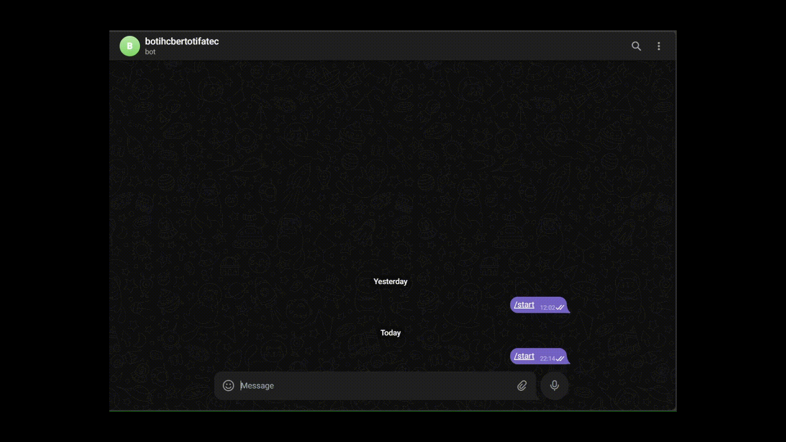

# ChatBot com Processamento de Linguagem Natural para disciplina de interação humano computador
<h2> Prof Juliano Bertoti </h2>

Este é um bot simples de Telegram que utiliza Processamento de Linguagem Natural (NLP) para responder a perguntas com base em um conjunto de dados sobre pontuações gerais de escolas nos Estados Unidos de 2006 a 2010.
## Pré-requisitos

- Python 3.x instalado
- Dependências
  #### python-telegram-bot
  #### pandas
  #### pandasai  

  <h1> Gif do bot funcionando: </h1>
  

  

## ALUNOS:

###  Pedro Henrique Silva De Almeida
###  Vitor Garcez
###  Igor Pereira